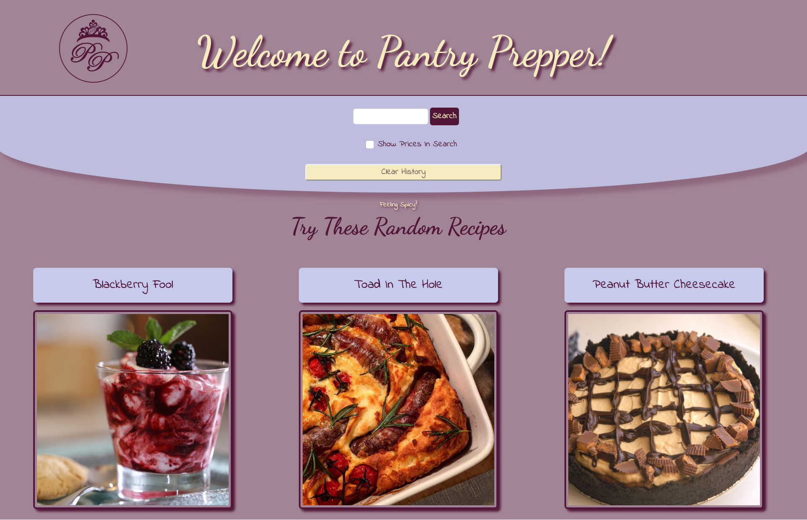
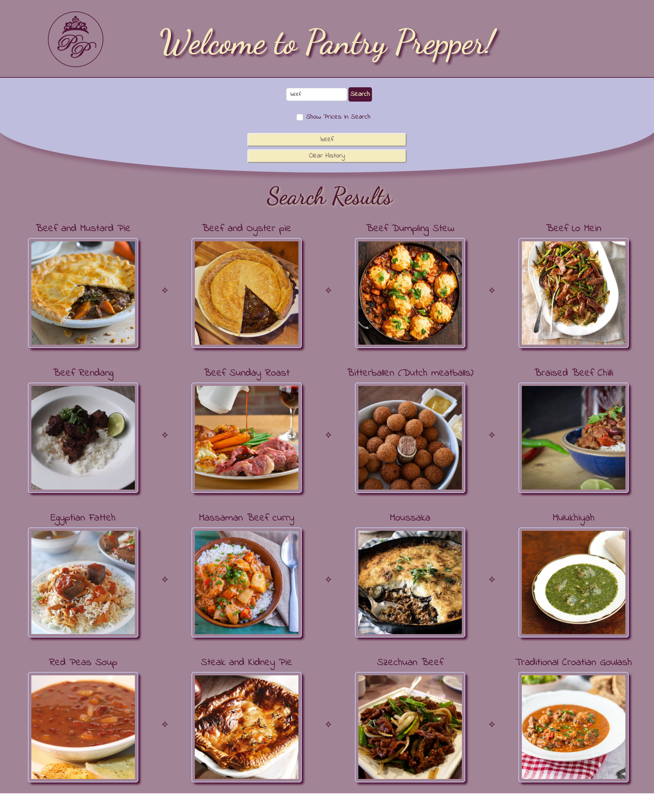

# Pantry Prepper

## Table Of Contents
1. [Description](#description)
2. [Usage](#usage)
3. [Visuals](#visuals)
4. [Authors and Acknowledgement](#authors-and-acknowledgement)
5. [Resources](#resources)

## Description 
Life can be a bit stale sometimes, we wanted to make a site that could deliver something new to the user. Being hungry for both food and knowledge, we decided to make a website that generates recipes that include the users desired ingredient of their choice. 

Features include:

- Dynamically updated data fetched from two server-side APIs: 

   themealdb: https://www.themealdb.com/api.php

   spoonacular: https://spoonacular.com/food-api
- Usage of HTML, CSS, JavaScript, and Bootstrap
- Accepts and responds to user input
- Modal to alert user of invalid search
- Local storage saves previous searches 
- UI is responsive to different screen sizes

## Usage

First, the user is greeted by three randomly populated recipes. If the user would like to learn more about those recipes, they simply click on their title, and a new tab opens with more info on that recipe. 

If the random recipes don't suit the user's fancy, then they may search for a desired ingredient. Upon the users search, our site finds all recipes that include their desired ingredient and displays them to the user. 

If the user would like to know the average price for their desired ingredient, they may also find that with a simple check of a checkbox found below the user's search input.

Previous searches will be saved to local storage and displayed at buttons for the user to access those recipes quickly and easily. This can be cleared with a clear history button.

## Visuals
- Home Page

- Search Results Page

## Authors and Acknowledgement
- Cody Theroux
- Kristin Kleyla
- Ben Ashworth

## Resources
[Repo Link](https://github.com/kleylakb89/pantry-prepper) 

[Live Site](https://kleylakb89.github.io/pantry-prepper/)
 
